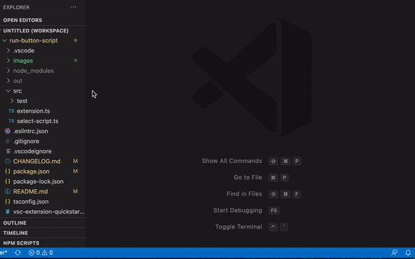

<a href="https://marketplace.visualstudio.com/items?itemName=leach-chen.vscode-develop-tools#overview"> </a> <a href="https://marketplace.visualstudio.com/items?itemName=leach-chen.vscode-develop-tools#review-details"></a>

# Introduce

**Develop tools bundle make develop more simple,now support run scripts,more features will be added later**

## **1：Run Scripts**

- the extension allows you run package.json scripts command with npm by run button or run yourself command quickly

- 扩展插件可以通过运行按钮运行项目目录下 package.json scripts 里面的命令，也可以通过运行按钮快捷执行你的自定义命令



# Usage

## **1：Run Scripts**

- you can add command at **“package.json“** in **“scripts“** part,the command will run with “npm“ use a new terminal

- 在项目目录下的 package.json scripts 里添加要运行的命令，则可以通过运行按钮以 npm 的方式执行，默认会打开一个新的命令行窗口执行命令

```
 package.json

 "scripts": {
    "vscode:prepublish": "npm run package",
    "compile": "webpack --devtool nosources-source-map --config ./build/node-extension.webpack.config.js",
    "watch": "webpack --watch --devtool nosources-source-map --info-verbosity verbose --config ./build/node-extension.webpack.config.js",
    "package": "webpack --mode production --config ./build/node-extension.webpack.config.js",
  }
```

- you can run yourself command,you should create a **“dtconfig.json“** at your workplace then you should add a json with **“execCmd“** part. if command start with **“newcmd“**,the command run will create a new terminal

- 在项目目录下，新建 dtconfig.json 文件，在里面添加包含 execCmd 的 json 格式数据，这样可以通过运行按钮快捷执行自定义命令。命令默认以第一个打开的命令窗口运行，若运行的命令需要用新打开的命令窗口运行，则在命令前面添加 newcmd

```
dtconfig.json

{
    "execCmd": {
      "Android Log": "react-native log-android",
	  "Android Log Create": "newcmd react-native log-android"  //if command start with "newcmd",the command run will create a new  terminal
    }
}
```

# Installation

In the command palette (`CMD + SHIFT + P`) select “Install Extension” and choose "Develop Tools”
